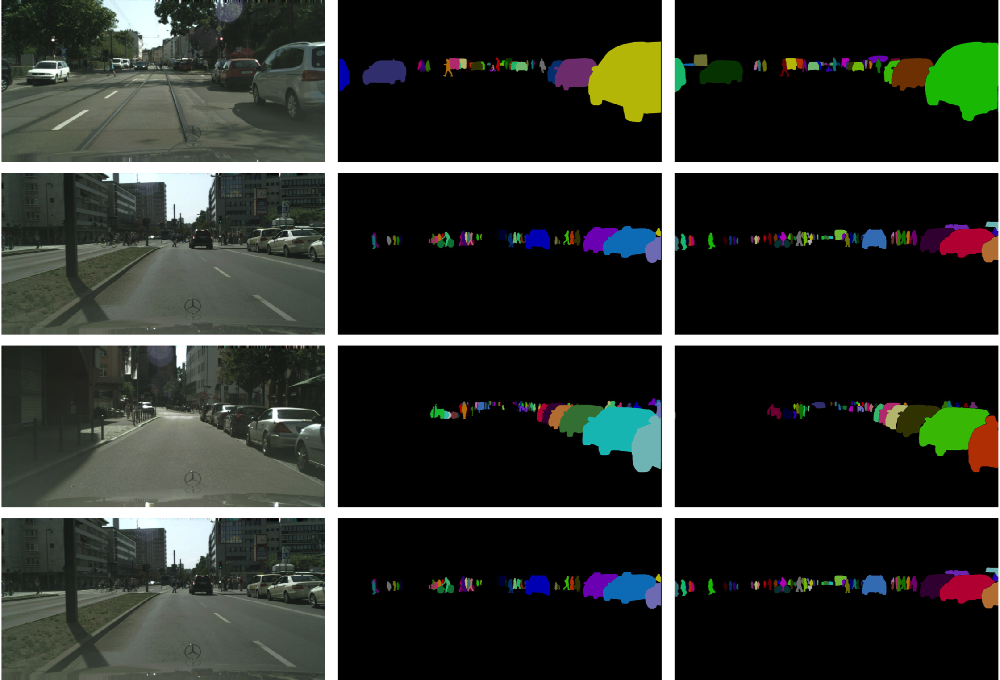

# [Paper](http://openaccess.thecvf.com/content_CVPR_2019/papers/Neven_Instance_Segmentation_by_Jointly_Optimizing_Spatial_Embeddings_and_Clustering_Bandwidth_CVPR_2019_paper.pdf)

* **Title**: Instance Segmentation by Jointly Optimizing Spatial Embeddings and Clustering Bandwidth
* **Authors**: Davy Neven, Bert De Brabandere, Marc Proesmans, Luc Van Gool
* **Link**: http://openaccess.thecvf.com/content_CVPR_2019/papers/Neven_Instance_Segmentation_by_Jointly_Optimizing_Spatial_Embeddings_and_Clustering_Bandwidth_CVPR_2019_paper.pdf
* **Tags**: Neural Network, Computer Vision, Instance Segmentation
* **Year**: 2019

# Summary

* What
  - Authors formulated a new loss function to use with R-CNN for proposal-free instance segmentation suited for realtime performance which directly optimizes the intersection-over-union of each instance by pulling pixels into an optimal, object-specific clustering region.
* How
  - To solve the issue authors proposed to learn an instance specific margin.
  - In order to do so, authors proposed to use a gaussian function for each instance, which converts the distance between a (spatial) pixel embedding `e_i = x_i + o_i` and the instance centroid into a probability of belonging to that instance.
  - As opposed to using the standard cross-entropy loss function, authors opted for using the Lovasz-hinge loss instead. Since this loss function is a (piecewise linear) convex surrogate to the Jaccard loss, it directly optimizes the intersection-over-union of each instance.
  - Authors trained the seed map with a regression loss function. Background pixels are regressed to zero and foreground pixels are regressed to the output of the gaussian. Authors trained a seed map for each semantic class.
  - As a basic architecture ERFNet was used. It is a dense-prediction encoder-decoder network optimized for real-time semantic segmentation. Authors converted the model into a 2-branch network, by sharing the encoder part and having 2 separate decoders. The first branch predicts the sigma and offset values, with 3 or 4 output channels depending on sigma. The other branch outputs N seed maps, one for each semantic class.
  - Authors first pre-train our models on `500 x 500` crops, taken out of the original `2048 x 1024` train images and centered around an object, for 200 epochs with a batch-size of 12. This way, authors didn't spend to much computation time on background patches without any instances. Afterwards authors finetuned the network for another 50 epochs on `1024x1024` crops with a batch-size of 2 to increase the performance on the bigger objects who couldn’t fit completely within the `500x500` crop. During this stage, authors kept the batch normalization statistics fixed. Authors used the Adam optimizer and polynomial learning rate decay.
* Results
  - Authors evaluated method on the challenging Cityscapes benchmark and achieve top results (5% improvement over Mask R-CNN) at more than 10 fps on 2MP images.
  - Cityscapes dataset results
    
